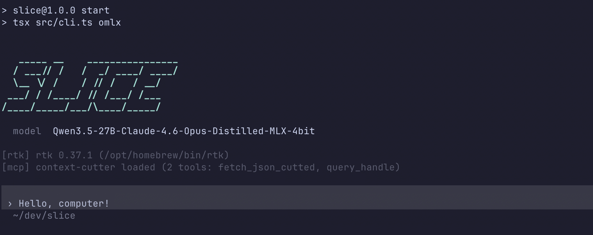

# Slice

A token-efficient, terminal-based AI coding assistant powered by the [Vercel AI SDK](https://sdk.vercel.ai). Run it against OpenRouter, OpenAI, Anthropic, GitHub Copilot, Ollama, or any OpenAI-compatible endpoint.

Slice keeps context small, reads only what it needs, and responds tersely — designed for developers who want a fast assistant that stays out of the way.



## Features

- **Block/bordered/plain input styles** — Adaptive terminal background, Tab completion for commands
- **Multi-turn conversation** — Full history passed to the model for context continuity
- **File tools** — `file_read`, `file_write`, `file_edit`, `glob`, `grep`, `list_dir`, `shell`
- **Slash commands** — `/model`, `/new`, `/help`, `/compact`, `/session`, `/export`
- **Context compaction** — LLM-powered summarization of long conversations via `/compact`
- **Provider-agnostic** — OpenRouter (default), OpenAI, Anthropic, Ollama, or any OpenAI-compatible endpoint

## Requirements

- Node.js 18+
- An API key for your chosen provider (or a local Ollama instance — no key needed)

## Setup

```bash
git clone https://github.com/nikitaclicks/slice.git
cd slice
npm install
```

Config is split into a public file (committed) and a local file (gitignored). Create both in the project root:

**`agent.config.json`** — committed, no secrets:
```json
{
  "provider": "openrouter",
  "baseURL": "https://openrouter.ai/api/v1",
  "model": "minimax/minimax-m2.5:free"
}
```

**`agent.config.local.json`** — gitignored, API key only:
```json
{
  "apiKey": "sk-or-..."
}
```

The local file is merged on top of the public one at startup. Any field can go in either file — `local.json` always wins.

Then run:

```bash
npm start
```

## Profiles

Profiles let you maintain multiple named configurations — one per provider, model, or use case — and switch between them at startup.

Each profile follows the same public/local split:

```bash
agent.config.json              # default public config — committed
agent.config.local.json        # default secrets — gitignored
agent.work.config.json         # work profile public config — committed
agent.work.config.local.json   # work profile secrets — gitignored
```

```bash
npm start              # loads agent.config.json
npm start work         # loads agent.work.config.json
npm start local        # loads agent.local.config.json
```

Each profile config is a full `agent.config.json` — set whichever fields differ and the rest fall back to defaults. Profiles also activate matching entries in `prompts.config.yaml` (see [Custom Prompts](#custom-prompts)).

### Inspect the active system prompt

```bash
npm start -- --print-system-prompt
npm start -- work --print-system-prompt
```

## Provider Configuration

Set `provider`, `baseURL`, and `model` in `agent.config.json` (committed). Put `apiKey` in `agent.config.local.json` (gitignored).

### OpenRouter

`agent.config.json`:
```json
{
  "provider": "openrouter",
  "baseURL": "https://openrouter.ai/api/v1",
  "model": "minimax/minimax-m2.5:free"
}
```
`agent.config.local.json`:
```json
{ "apiKey": "sk-or-..." }
```

### OpenAI

`agent.config.json`:
```json
{
  "provider": "openai",
  "model": "gpt-4o"
}
```
`agent.config.local.json`:
```json
{ "apiKey": "sk-..." }
```

### Anthropic

`agent.config.json`:
```json
{
  "provider": "anthropic",
  "model": "claude-sonnet-4-6"
}
```
`agent.config.local.json`:
```json
{ "apiKey": "sk-ant-..." }
```

### GitHub Copilot (GitHub Models)

`agent.copilot.config.json`:
```json
{
  "provider": "openai",
  "baseURL": "https://models.inference.ai.azure.com",
  "model": "gpt-4o"
}
```
`agent.copilot.config.local.json`:
```json
{ "apiKey": "ghp_..." }
```

```bash
npm start copilot
```

Get a token at **github.com → Settings → Developer settings → Personal access tokens**. Free tier includes generous model access. Model IDs: `gpt-4o`, `gpt-4.1`, `gpt-4.1-mini`, `o4-mini`.

### Any OpenAI-compatible endpoint (local or proxy)

```json
{
  "provider": "openai",
  "baseURL": "http://localhost:1234/v1",
  "apiKey": "your-key",
  "model": "your-model-name"
}
```

### Ollama (no API key needed)

```json
{
  "provider": "ollama",
  "model": "llama3.2"
}
```

## Custom Prompts

System prompts are configured in `prompts.config.yaml` (committed to source control — no secrets here). Prompts are resolved in order from most to least specific:

1. **Profile** — matched by the profile name used to start Slice (e.g. `npm start copilot`)
2. **Provider + model** — matched by both provider and exact model ID
3. **Provider default** — matched by provider only
4. **Global default** — fallback for everything

```yaml
default: |
  You are Slice, a coding assistant...

  Current working directory: {cwd}

profiles:
  copilot: |
    You are Slice in copilot mode.
    Always use the ask_question tool when waiting for input...

providers:
  anthropic:
    default: |
      Prompt for all Anthropic models...
    models:
      claude-opus-4-7: |
        Prompt for Opus specifically...
  openrouter:
    default: ""
    models: {}
```

Use `{cwd}` anywhere in a prompt — it's replaced with the current working directory at runtime.

A `systemPrompt` field in `agent.config.json` takes precedence over everything in `prompts.config.yaml`, useful for per-profile secrets or absolute overrides.

## Slash Commands

| Command | Description |
|---------|-------------|
| `/new` | Start a fresh conversation (clears history) |
| `/compact` | Summarize older messages to reduce context size |
| `/session` | Show current model, message count, and token usage |
| `/export [file]` | Save conversation as a Markdown file |
| `/help` | List all commands |
| `exit` | Quit |

Type `/` and press **Tab** to see available commands.

## Configuration Reference

| Field | Default | Description |
|-------|---------|-------------|
| `provider` | `openrouter` | AI provider: `openrouter`, `openai`, `anthropic`, `ollama`, `omlx` |
| `apiKey` | — | API key for the selected provider |
| `baseURL` | — | Override the provider's default API endpoint |
| `model` | `nvidia/nemotron-3-super-120b-a12b:free` | Model ID (format depends on provider) |
| `maxSteps` | `20` | Max tool-use steps per turn |
| `timeout` | none | Agent run timeout in milliseconds. Omit (default) for no limit. Example: `3600000` for 1 hour |
| `sessionDir` | `.sessions` | Directory for session JSONL logs |
| `showBanner` | `true` | Show ASCII banner at startup |
| `display.inputStyle` | `block` | `block` / `bordered` / `plain` |
| `display.toolDisplay` | `grouped` | `grouped` / `emoji` / `minimal` / `hidden` |

## Tools Available to the Agent

| Tool | Description |
|------|-------------|
| `file_read` | Read file contents with optional offset/limit |
| `file_write` | Write or create files |
| `file_edit` | Search-and-replace edits |
| `glob` | Find files by glob pattern |
| `grep` | Search file contents by regex |
| `list_dir` | List directory contents |
| `shell` | Run shell commands |

## License

MIT
